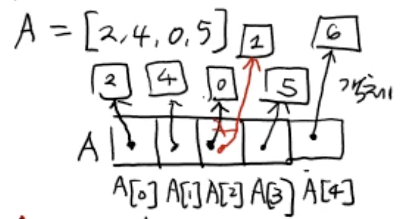

# 배열(Array) vs 리스트(List)

- 가장 기본적은 순차적인(sequeutial) 자료 구조 [ 매우기본, 중요 ]

## 배열(Array)

### C언어


### Python : list(리스트)


A.append(6) : 맨 뒤에 6을 삽입  


A.pop() : 맨 뒤에 값을 지우고 리턴  


A.pop(1) : A[1]을 지우고 리턴  


- 지워진 값의 오른쪽(더 큰 인덱스를 가진) 값이 왼쪽(더 작은 인덱스를 가진)으로 이동

A.insert(1, 10) : A[1]에 10을 삽입

- 기존 A[1] 포함 오른쪽(더 큰 인덱스를 가진) 값이 오른쪽으로 한칸씩(인덱스 증가)으로 이동

A.remove(value) : value를 지우고 리턴  
A.index(value) : value의 인덱스 리턴  
A.count(value) : value의 개수 리턴

## 리스트 (List)

- 용량(capacity) 자동 조절 ""( dynamic array )""

### C언어

```
int A[3] = {2, 4, 0, 5}
A[4] = 10;
// => error A[4]의 경우 A에 할당된 공간이 아니기 때문에 에러 발생
```

### Python

```
import sys

A = [] # 빈 리스트
print(sys.getsizeof(A)) # => 28bytes (운영체제 마다 상이)

A.append(10)
print(sys.getsizeof(A)) # => 44bytes (운영체제 마다 상이)
```

#### list class


```
A.append(x):
  if A.n < A.capacity:
    A[n] = x;
    A.n = n + 1
  else:
    B = A.capacity * 2 크기의 리스트 새롭게 할당
    for i in range(n):
      B[i] = A[i]
    del A;
    A = B;
    A[n] = x;
    A.n = n + 1
```
