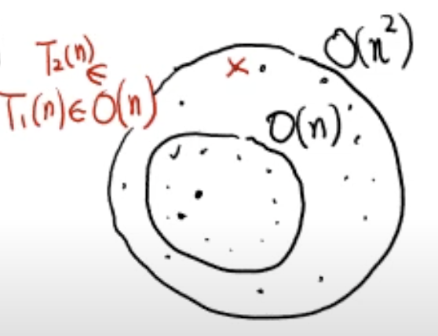
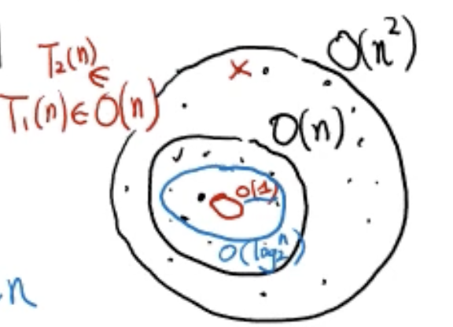

# Big-O 표기법

- 알고리즘의 수행시간 = 최악의 경우의 입력에 대한 기본연산 횟수

```
Algorithm1 : T₁(n) = 2n-1
(arrayMax)

Algorithm2 : T₂(n) = 4n+1
(sum1)

Algorithm3 : T₃(n) = 3/2n²-3/2n+1
(sum2)
```

1. Algorithm2가 Algorithm1보다 약 2배 느리다 : True
2. Algorithm3는 n < /frac{5}{3}면 Algorithm2보다 빠르다 : True
3. Algorithm3는 모든 N에 대해서 Algorithm1보다 느리다 : True
4. Algorithm3는 n > 5/3면 항상 Algorithm2보다 느리다 : True

T₁(n), T₂(n) : n에 대해 선형적으로 증가  
-> 최고 차항 n
T₃(n) : n에 대해 제곱으로 증가
-> 최고 차항 N²

: 증가률 n -> ♾️ T(n)↑

---

## 수행 시간 T(n) = 함수 값을 결정하는 최고 차항만으로 간단하게 표기 : Big-O 표기법

```
T₁(n) = 2n-1 -> O(n)
T₂(n) = 4n+1 -> O(n)
T₃(n) = 3/2n²-3/2n+1 -> O(n²)
```

1️⃣ 최고 차항만 남긴다.  
2️⃣ 최고차항 계수(상수)는 생략한다.  
3️⃣ Big-O (최고 차항)

- 집합으로 이해하기



_예시_

```
def increment_one(a):
  return a + 1
```

- T(n) = 1 -> O(1)

```
def numberof_bits(n):
  count = 0
  while n > 0:
    count += 1
    n = n // 2
  return count
```

- T(n) = C \* log₂ⁿ + 1 -> O(log₂ⁿ)


