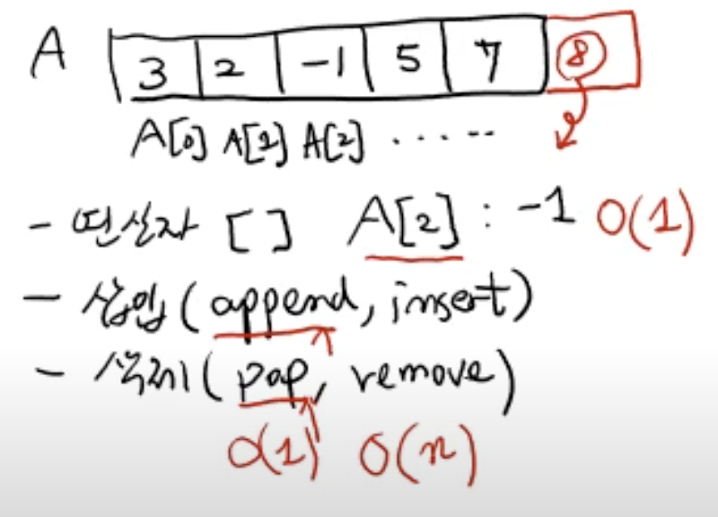
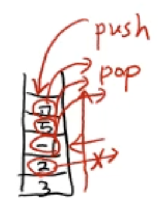
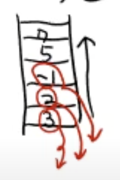
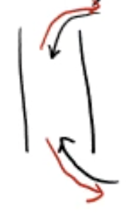
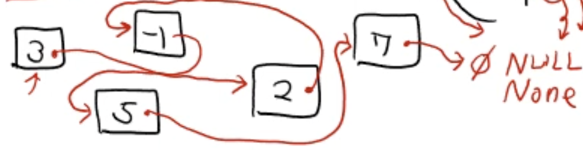

# 순차적 자료 구조 ( sequential data structures ) 소개

## 1. 배열 리스트

- index로 임의의 원소를 접근
  

## 2. stack, queue, dequeue

- 제한된 접근 ( 산입, 삭제 )만 허용

stack : LIFO ( Last In First Out ) - 후입선출

queue : FIFO ( First In First Out ) - 선입선출  

dequeue : LIFO or FIFO

## linked list ( 연결 리스트 )

Python List 와는 전혀 다름

- 인덱스로 접근 불가능
- N 번째 요소를 찾기 위해서는 N번 링크를 타야함
